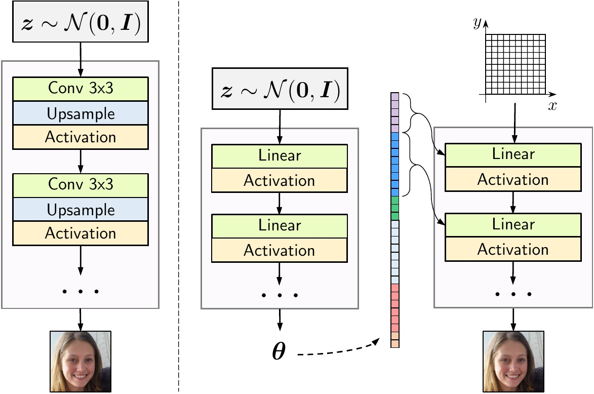

## Adversarial Generation of Continuous Images [CVPR 2021]

This repo contains [INR-GAN](https://arxiv.org/abs/2011.12026) implementation built on top of the [StyleGAN2-ADA](https://github.com/NVlabs/stylegan2-ada-pytorch) repo.
Compared to a traditional convolutional generator, ours is [INR](https://vsitzmann.github.io/siren/)-based, i.e. it produces parameters for a fully-connected neural network which generates pixel values independently based on their coordinate positions (see the illustration below).

<div style="text-align:center">

</div>

### Performance
We provide the checkpoints of our model with the following FID scores.
See [Pretrained checkpoints](#pretrained-checkpoints) to download them.

| Model        | LSUN Churches 256x256 | LSUN Bedroom 256x256 | FFHQ 256x256 | #imgs/sec on V100 32gb | Memory usage             |
| ------------ |:---------------------:|:--------------------:|:------------:|:----------------------:|:------------------------:|
| INR-GAN      | 4.45                  | 5.71                 | 9.57         | 266.45 @ batch_size=50 | 23.54 Gb @ batch_size=50 |
| INR-GAN-bil* | 4.04                  | 3.43                 | 4.95         | 209.16 @ batch_size=50 | 23.56 Gb @ batch_size=50 |
| StyleGAN2    | 3.86                  | 2.65                 | 3.83         | 95.79 @ batch_size=32  | 3.65 Gb @ batch_size=32  |
| CIPS         | 2.92                  | -                    | 4.38         | 27.27 @ batch_size=16  | 8.11 Gb @ batch_size=16  |

*`INR-GAN-bil` model uses bilinear interpolation (and instance norm) which "deviates" from the INR "paradigm" because pixels are now generated non-independently. However, it still uses only fully-connected layers (i.e. no convolutions) to generate an image.

The inference speed in terms of #imgs/sec was measured on a single NVidia V100 GPU (32 Gb) *without* using the mixed precision (see the [profiling](#Profiling) section below).

Note: our CIPS implementation is not exact. See [CIPS](https://github.com/saic-mdal/CIPS) for the exact one.

For INR-GAN, memory usage is increased for 2 reasons:
- we use coordinate embeddings for high-resolutions
- we cache coordinate embeddings at test time (when they do not depend on z)

Note that the profiling results can differ depending on the hardware and drivers installed (we used CUDA 10.1.243).

### Installation
To install, run the following command:
```
conda env create --file environment.yaml --prefix ./env
conda activate ./env
```

### Training
To train the model, navigate to the project directory and run:
```
python src/infra/launch_local.py hydra.run.dir=. +experiment_name=my_experiment_name +dataset.name=dataset_name num_gpus=4
```
where `dataset_name` is the name of the dataset without `.zip` extension inside `data/` directory (you can easily override the paths in `configs/main.yml`).
So make sure that `data/dataset_name.zip` exists and should be a plain directory of images.
See [StyleGAN2-ADA](https://github.com/NVlabs/stylegan2-ada-pytorch) repo for additional data format details.
This training command will create an experiment inside `experiments/` directory and will copy the project files into it.
This is needed to isolate the code which produces the model.

### Pretrained checkpoints
`INR-GAN` checkpoints:
- [LSUN Churches 256x256](https://kaust-cair.s3.amazonaws.com/inr-gan/checkpoints/churches.pkl) with FID = 4.45.
- [LSUN Bedrooms 256x256](https://kaust-cair.s3.amazonaws.com/inr-gan/checkpoints/bedrooms.pkl) with FID = 5.71 (setting truncation to 0.9 is crucial for it).
- [FFHQ 256x256](https://kaust-cair.s3.amazonaws.com/inr-gan/checkpoints/ffhq.pkl) with FID = 9.57.

For Churches, the model works well without additional convolutions on top of 128x128 and 256x256 blocks, that's why we do not use them for this dataset (i.e. `extra_convs: {}` in the `inr-gan.yml` config) which makes it run in 301.69 imgs/second.
We believe that the reason why it works better on Churches compared to other datasets is that this dataset contains more high-frequency details.

`INR-GAN-bil` checkpoints:
- [LSUN Churches 256x256](https://kaust-cair.s3.amazonaws.com/inr-gan/checkpoints/churches-bil.pkl) with FID = 4.04.
- [LSUN Bedrooms 256x256](https://kaust-cair.s3.amazonaws.com/inr-gan/checkpoints/bedrooms-bil.pkl) with FID = 3.43 (setting truncation to 0.95 is crucial for it).
- [FFHQ 256x256](https://kaust-cair.s3.amazonaws.com/inr-gan/checkpoints/ffhq-bil.pkl) with FID = 4.95.

### Data format
We use the same data format as the original [StyleGAN2-ADA](https://github.com/NVlabs/stylegan2-ada-pytorch) repo: it is a zip of images.
It is assumed that all data is located in a single directory, specified in `configs/main.yml`.

For completeness, we also provide downloadable links to the datasets:
- [LSUN Churches 256x256](https://kaust-cair.s3.amazonaws.com/inr-gan/datasets/church_outdoor_train_256.zip) of size 1.8 GiB. The original source is [https://www.yf.io/p/lsun](https://www.yf.io/p/lsun).
- [LSUN Bedroom 256x256](https://kaust-cair.s3.amazonaws.com/inr-gan/datasets/bedroom_train_256.zip) of size 32.8 GiB. The original source is [https://www.yf.io/p/lsun](https://www.yf.io/p/lsun).
- [FFHQ 256x256](https://kaust-cair.s3.amazonaws.com/inr-gan/datasets/ffhq_256.zip) of size 6.5 GiB. The original source is [https://github.com/NVlabs/ffhq-dataset](https://github.com/NVlabs/ffhq-dataset).

Download the datasets and put them into `data/` directory.

### Profiling
To profile the model, run:
```
CUDA_VISIBLE_DEVICES=0 python src/scripts/profile.py hydra.run.dir=. model=inr-gan.yml
```

The inference speed in terms of #imgs/sec was measured on a single NVidia V100 GPU (32 Gb).
Note, that this model was developed *before* StyleGAN2-ADA, i.e. before mixed precision was a thing.
With mixed precision enabled, StyleGAN2 produced 256.88 #imgs/sec @ batch_size=128.
INR-GAN (default architecture) with mixed precision gives only 465.60 #imgs/sec @ batch_size=100 (only 50% speed increase compared to its full-precision version) and we didn't try training it (performance might drop).
We also compared to [CIPS](https://github.com/saic-mdal/CIPS) (which is a parallel work that explores INR-based generation) in terms of speed (didn't try training it).
For all the models, we used the optimal batch size unique for them.

### License
This repo is built on top of [StyleGAN2-ADA](https://github.com/NVlabs/stylegan2-ada-pytorch), so I assume it is restricted by the [NVidia license](https://nvlabs.github.io/stylegan2-ada-pytorch/license.html) (though I am not a lawyer).


### Bibtex
```
@article{inr_gan,
    title={Adversarial Generation of Continuous Images},
    author={Ivan Skorokhodov and Savva Ignatyev and Mohamed Elhoseiny},
    journal={arXiv preprint arXiv:2011.12026},
    year={2020}
}

@article{cips,
    title={Image Generators with Conditionally-Independent Pixel Synthesis},
    author={Anokhin, Ivan and Demochkin, Kirill and Khakhulin, Taras and Sterkin, Gleb and Lempitsky, Victor and Korzhenkov, Denis},
    journal={arXiv preprint arXiv:2011.13775},
    year={2020}
}
```
